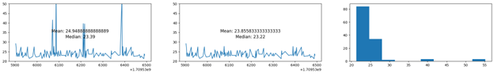
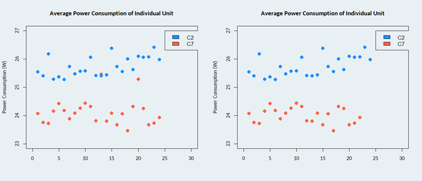
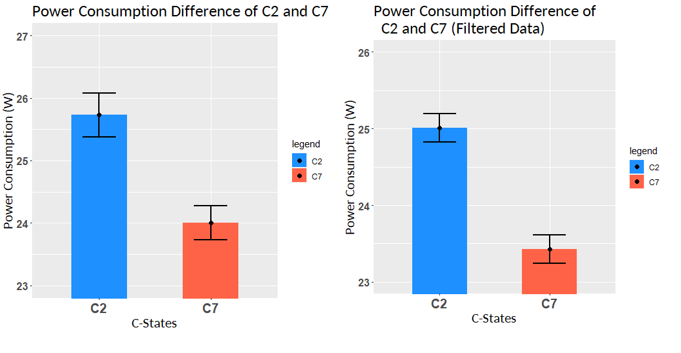

# Code Example and Results for SCI 201 Project

This repo is for the codes and implenmentation regarding the project "The Effect of C-States and Their Impacts Idle Power Consumption of a Linux Home Server". The results will also be published once the project is done.

## Table of Contents
- [Introduction](#introduction)
- [Methods](#methods)
- [Results](#results)
    - [Original Data](#original-data)
    - [Filtered Data](#filtered-data)
    - [Summary Graphs](#summary-graphs)
- [Discussion](#discussion)
    - [Limitations](#limitations)
- [Conclusion](#conclusion)
    - [Future Work](#future-work)

> TLDR: There is a statistically significant different in idle power consumption between CPU C-states and higher C-states have lower power consumption. 


### InfluxDB Code

The data collection utilize the time series database InfluxDB. [Methods](#methods). The code that is used to collect the data is found as `influxdb.py` and `influxdb.ipynb`. The code is written in Python and uses the `influxdb` library. It connects to the influxdb server, query the data of the last 10 minutes interval (see [Methods](#methods)), starting from 15 minutes ago and ending 5 minute ago, this is used because querying can take some time and may affect power consumption. The script create a unique ID that is the utime, hour of day and calculate the CPU utilization for that same interval, these are static data. The script also return every point of measurement in that interval with time and power consumption. For each point, the static data and time and power consumption value is written to a csv file.

### Data Processing

The data is processed using pandas and visualized with matplotlib, the code is found in `analysis.ipynb`. Since influxdb code write a unique ID for every time it runs, the data is processed by reading the csv file, select the c-state of interest, and loop over each unique ID. For each UID, the time and power consumption is plotted as a scatter plot to observe trends. There is also an option to filter out data that is above a threshold. The average power consumption of that interval is calculated using integration over time, it also calculate the median, 25% percentile, filtered average. Then it is written to a csv file for analysis.

#### Using The Code

Activate a virtual environment and install the `influxdb` and `python-dotenv` library using pip:
```bash
python3 -m venv venv
source venv/bin/activate
```
```bash
pip install influxdb_client python-dotenv
```
Fill out the `.env` file with the following information:
```ini
INFLUXDB_URL=''
INFLUXDB_TOKEN="" 
INFLUXDB_ORG=""
INFLUXDB_BUCKET=""
```
To use a different treatment (C2,C7), the code has to be adjusted manually.

The code only run once, the data collection is done by a cron job. The cron job is set to run every hour at 20 min according to the design of the experiment. To schedule the cron job, edit crontab as such:

```bash
20 22-23,0-10 * * * cd $this_working_dir && venv/bin/python influxdb.py
```

### RStudio Code (Randomized Block ANOVA)

The software for graphing and analysis is RStudio. The code `analysis.R` is used. The code will check assumptions of parametric t-test, do the analysis, and also plot the data appropriately. It also attempts to do Randomized Block ANOVA in case there are significant difference between the hours of day as well as ANCOVA (Analysis of Covariance) to check if the CPU utilization has an effect on power consumption. 

## Introduction

To read the full report with citations, you can find it in the [release](https://github.com/vttc08/sci-201-cpu-c-states/releases) section of this repository. The data (in csv format) is also available in the release section.

Home servers are always online and provide useful services, however, they consume a lot of power as it's always on. Optimizing for CPU C-states can reduce power consumption. CPU C-states are states which a CPU can take place when it's idling, ranging from C0 to C10 where higher the number, the more power savings. However, CPU are unable to enter higher C-states due to incompatible hardware or software, for example, a common SATA card JMB585 which is included by many Chinese NAS motherboards and can expand the number of SATA ports, is unable to enter C3 or above; meanwhile, alternative cards like ASM1166 can enter higher C-states. The project aims to investigate the effect of C-states on power consumption of a home server. Due to limitations of the study, only 2 C-states will be tested, C2 and C7. C7 is the maximum C-state that my server can enter, while C2 occurs without any power saving tweaks. Electricity prices are increasing throughout the world, and this project aims to provide a solution to reduce power consumption of home servers. Should there be significant difference between the power consumption among different C-states, users should opt for hardware and tweak software to enable higher C-states. The hypothesis is that there is a significant difference in power consumption between C2 and C7 CPU C-states, with C7 having the lowest idle power consumption.

## Methods

The experiment was conducted with two treatment levels (C2 and C7) randomly assigned to two selected days. Systematic sampling was performed, with measurements taken every hour in a 10-minute interval. The average power consumption of the server during each interval was recorded as the study units. The use of a 10-minute interval reduces measurement errors and provides a more relevant average consumption value. The experiment used the Linux tool "powertop" to achieve the C7 treatment and recorded the data using a Sonoff S31 Wi-Fi Smart Plug. The data was imported into Home Assistant and InfluxDB for easy access. A Python script was used to query the database and record the time and power consumption into a CSV file. Data analysis was performed using the pandas toolkit, including trapezoidal rule integration to calculate the average power consumption. Spikes in the data, indicating CPU activity, were removed by setting a threshold and filtering out data above it.


Figure 1: Example of data filtering

The data was analyzed using RStudio, with the assumptions of parametric t-test checked and Randomized Block ANOVA performed. The Randomized Block ANOVA was used to check if there is a significant difference between the hours of day. ANCOVA was also performed to check if the CPU utilization has an effect on power consumption. The results were plotted using ggplot2.

## Results

#### Original Data

Table 1: Summary of original data.

| Groups | n  | Mean |   SD   |   SE   |
|--------|----|------|--------|--------|
|   C2   | 24 | 25.73| 0.3506 | 0.0716 |
|   C7   | 22 | 24.00| 0.2747 | 0.0586 |

Table 2: R Output of Shapiro-Wilks test of C2 and C7 of original data

| Groups |    W    | P-Value |
|--------|---------|---------|
|   C2   | 0.91433 | 0.04382*|
|   C7   | 0.95951 |  0.4795 |

Table 3: R Output of Two-Sample Pooled t-test using original data

Data: C7$mean and C2$mean
|   t    | df |  P-value   | Lower 95% CI | Upper 95% CI |
|--------|----|------------|--------------|--------------|
| -18.481| 44 | < 2.2*10-16*|   -1.9159    |   -1.5392    |

Alternative hypothesis: true difference in means is not equal to 0

#### Filtered Data

Table 4: Summary of filtered data.

| Groups       | n  | Mean  |   SD   |   SE   |
|--------------|----|-------|--------|--------|
| C2 Filtered  | 24 | 25.01 | 0.1848 | 0.0377 |
| C7 Filtered  | 22 | 23.43 | 0.1853 | 0.0395 |

Table 5: R Output of Shapiro-Wilks test of C2 and C7 of filtered data

| Groups |     W    |  P-Value  |
|--------|----------|-----------|
|   C2   |  0.88155 | 0.008929* |
|   C7   |  0.90426 |  0.0362*  |

Table 6: R Output of Mann-Whitney U-test using filtered data

Data: C7$filtered and C2$filtered

|   W    |   P-Value   |
|--------|-------------|
| -18.481| 2.535x10-13*|

Alternative hypothesis: true location shift is not equal to 0

#### Summary Graphs



Figure 2: Dot plot showing individual points of each treatment in my original data. Left is without the removal outliers; right is when the outliers are removed.



Figure 3: Bar plot of power consumption (W) between C2 and C7 C-states. Blue bar is C2, and red bar is C7, error bar shows the standard deviation. Left is using the original data; right plot is the filtered data. The y-axis scale is different.

## Discussion

From my results, both the original and filtered data indicate a statistically significant difference in power consumption between C2 and C7 (Table 3&6) (Figure 3). The original data is more relevant in the real-world, so I will be using it for this experiment. The results support the hypothesis that there are significant differences in idle power consumption between C2 and C7 CPU C-states, with C7 having the lowest idle power consumption. Similar experiments by users on discussion forums have reported power savings of 2 to 5W or more by applying CPU C-state optimizations. However, it's important to note that individual results may vary due to different hardware and software configurations.

The power savings observed in this experiment are supported by literature. Modern CPUs have features like "Idle State" and "Speed Step" that regulate voltage, frequency, and power management. Deeper C-states, like C7, result in larger power savings due to reduced voltage and frequency, memory availability, cache flushing, and deactivation of peripherals. System-level optimizations, such as active state power management (ASPM) and SATA active link power management (ALPM), further contribute to power savings. These findings highlight the importance of optimizing CPU C-states to reduce power consumption.

#### Limitations

The study has limitations. The experiment was conducted on a remote server in production, limiting modifications and improvements. Only 2 C-states could be tested because these modifications require physical access to the server by tweaking the BIOS, this is not possible to do remotely. Extraneous variables like disk activity, network activity, and CPU load were also not accounted for.

## Conclusion

The experiment has shown that there is a significant difference in power consumption between C2 and C7 CPU C-states, with C7 having the lowest idle power consumption. The results support the hypothesis that there are significant differences in idle power consumption between C2 and C7 CPU C-states. These findings highlight the importance of optimizing CPU C-states to reduce power consumption. 

#### Future Work

Based on the results of my study, it is recommended that individuals building a home server should purchase peripherals that support power-saving standards like ASPM and avoid those that do not. This ensures that the CPU can enter higher C-states, such as C7, which provided a significant reduction in idle power consumption compared to C2. To address the weaknesses of this study, an improved version should be conducted on-site with a spare system, controlling for extraneous variables. C-state treatments should be adjusted properly using the mainboard BIOS to allow for testing of more treatment levels and gain a better understanding of the effects of C-states. Additionally, analysis of covariance can be used to address continuous explanatory variables such as percentage system load, disk usage, and network usage, which could have an effect on power consumption regardless of C-states.


